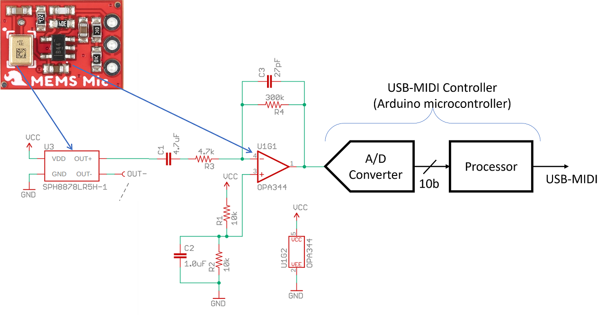

# Analog-IC-Design

This repository contain the design,simulation and analysi of an interface circuit for a MEMS microphone,developed during an internship on Analog IC Design.The project involved::

- Modeling the MEMS microphone with a Thevenin equivalent.
- Design, simulation, and circuit characterization of a low-noise Op-Amp preamplifier (TI OPA344 reference) using ngspice.
- Schematic capture using Xschem and circuit analysis (DC/transient) with ngspice.
- Application of passive RLC modeling, KCL, KVL, and superposition.
- Network analysis plus Thevenin/Norton transformations for optimized power transfer.
- Analog building block design/analysis: current mirrors, differential amplifiers, and MOS characteristics.
- Complete system simulation and robust USB-MIDI audio characterization.

  
## USB Microphone System

[MEMS capacitive microphone datasheet](https://cdn.sparkfun.com/assets/0/5/8/b/1/SPH8878LR5H-1_Lovato_DS.pdf)
## Thevenin equivalent model calculation

- **Sensitivity:** -44 dBV/Pa  
- **Condition:** 94 dB SPL at 1 kHz (equivalent to 1 Pa sound pressure)  
- **Typical Voice Conversation Level:** ~60 dB SPL

 Vth (Voltage Threshold) Calculation

- Voice (Pa) = 10(60−94)/20=19.9×10⁻³Pa  
- Output (Vpk) = 2×Vrms=2×19.9×10⁻³Pa×10^(−44/20)=178μVpk  
- Vout−pk=0.178 mV

Rth (from datasheet) = 380 ohms  

- From schematic: Rin=5k, Rfb=300k, therefore Gain = 60  
- So output of the amplfier will be 60 x 0.178 mVpk = 10.68 mVpk  
- Sparkfun site states 100 mVpk probably assuming 10 times higher input signal i.e. Voice is 80 dB SPL
- Input high-pass frequency = 1/2πRC = 1/2π × 5k × 4.7μF = 6.77 Hz  
- Feedback Low-pass filter frequency = 1/2πRC = 1/2π × 300k × 27pF = 19.6 kHz  
- Input common-mode filter = 1/2πRC = 1/2π × 10k × 1μF = 15.9 Hz

## XSCHEM SIMULATIONS
   ## *1.Thevenin Equivalent model of the microphone*

  
    

   
   ## *2.High-Pass*

  
   

    

  ## *3.NMOS Operational Amplifier*

   

     
   
  ## *4.Current Mirror*

  

     

  ## *5.Mictest*
 
   
   

   
## NGSPICE RESULTS

  ## *1.Simple-high pass filter*
  
   
   

  ## *2.Transient experiment: rise, fall, delay, time period*

  

  ## *3.Diode experiment*
  
   

    
## MAGIC
## *1.CMOS Inverter*
  
   
